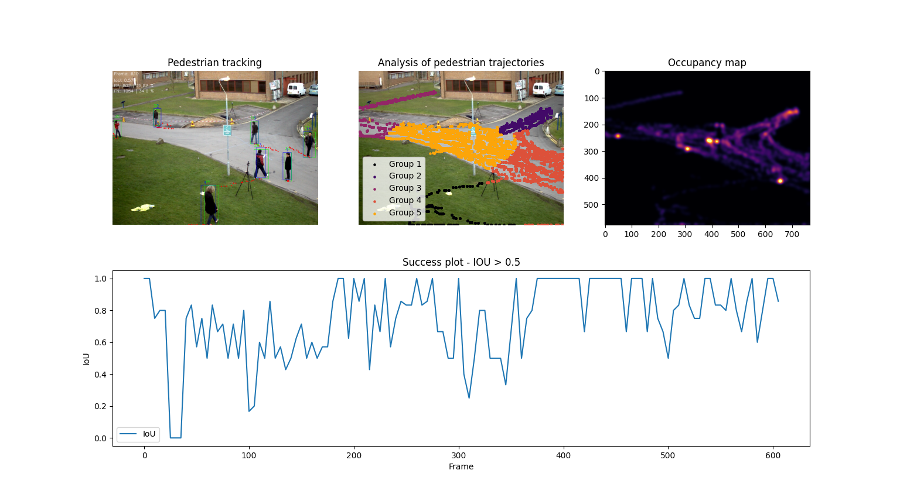

# People tracking

Human activity analysis using pedestrian’s trajectories performed in open spaces. Using dataset [PETS 2009 Benchmark Data S2L1](https://cs.binghamton.edu/~mrldata/pets2009).

## Goals
The work will have several goals, the majority intend to enrich the visual information that can be extracted from the image sequence. Thus, the students are welcome to fulfill the following challenges: 

1)	Plot the GT (readable from the GT.txt file) and draw the bounding boxes in each frame in the sequence, (see Fig. 2 right).
2)	Now, using your detector algorithm, perform the tracking of pedestrians. The predicted bounding boxes should be visible for each detection. Assign a label (i.e., a number) for each detected bounding box. At this stage is not required to have the same label assigned for a given pedestrian. Label switching can occur. (4.0v) 
3)	Plot the performed trajectories. To avoid a possible excess of the information visualisation, you can plot the trajectories dynamically. (4.0v) 
4)	Provide consistent labels through time. This means that a given pedestrian should be assigned to the same label through the sequence. (2.0v) 
5)	Provide to the user, the information regarding the map (i.e., occupancy) of the trajectories performed in the video. Specifically 
a.	Provide a heatmap, using a Gaussian distance metric (or other), where the color is assigned to the number of occurrences in a given position (region) of the image. Concerning this regard different heatmaps can be generated, this can include (i) static heatmap, (ii) dynamic heatmap. (2.0v) 
6)	Using the Expectation-Maximization (EM) algorithm, provide a statistical analysis concerning the trjectories performed by pedestrians. (1.5v) 
7)	Provide an evaluation performance of the algorithm. Specifically provide: (i) the success plot (see Sec. IV for details), and (ii) the percentage of False Negatives (FN) or misdetections and False Positives (FP). Please provide figures illustrating the success plot, FPs and FNs, and also some frames illustrating the FPs and FNs. (3.5v)

## Implementation

## Used libraries
* Matplotlib
* OpenCV
* Pandas
* SciPy
* Scikit-learn
